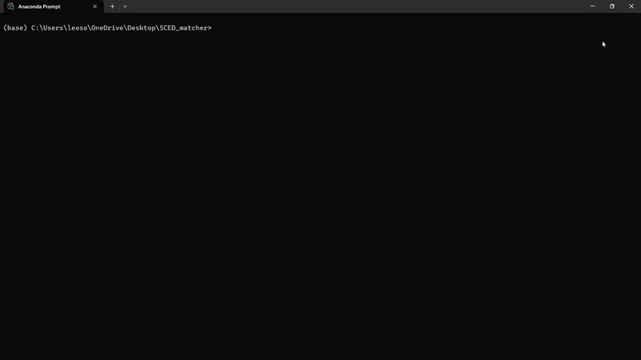

# NCES School Courses for the Exchange of Data (SCED) Codes Matching Tool
A tool for matching K-12 course names and descriptions to standardized NCES School Courses for the Exchange of Data (SCED) codes.

## Instructions
Run with ```python sced_matcher.py```. Requires a valid Google Gemini (AI Studio) API key (store this in a *.env* file).

There are two options - you can search for an individual course code, or provide a file path to a csv file with multiple rows of course names/descriptions.


